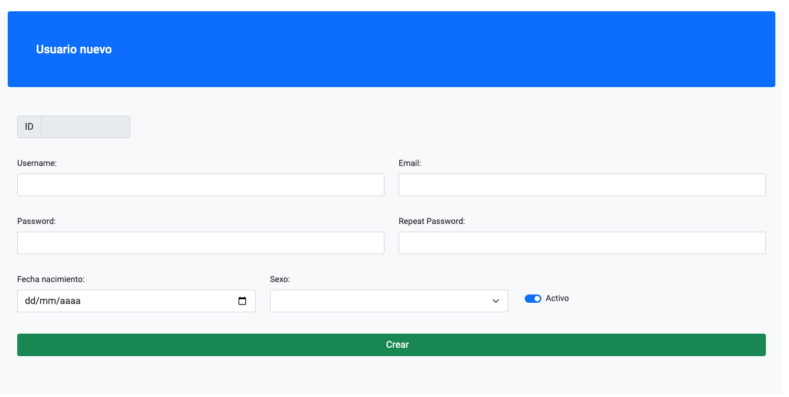
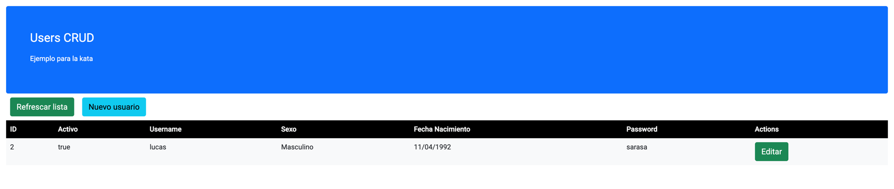

# Angular-introduction

Introduccion a Angular

# Prequisitos

- Tener instalado Node.js
  - Instalar desde https://nodejs.org/en/download/
  - Validar con el comando: `node -v`
- Tener instalado NPM
  - ya viene instalado con Node, en caso de problemas instalar NVM desde https://github.com/nvm-sh/nvm#intro
  - Validar con el comando: `npm -v`
- IDE para web y si ayuda con angular mejor

# Primeros pasos

1 - Dentro de este proyecto, instalar Angular Cli (cliente) con el comando: `npm install -g @angular/cli`

Mientras se instala....

### Que es Angular?

Es una plataforma de desarrollo escrita en [TypeScript](https://www.typescriptlang.org/) que incluye:
- Framework basado en componentes para desarrollo web
- Coleccion de librerias para ruteo, manejo de formularios, comunicacion con servidor, etc
- Herramientas de desarrollo, compilacion, testeo y actualizacion de codigo

### Crear y levantar el proyecto

El proyecto ya fue creado utilizando el comando: `ng new angular-introduction`

Para levantarlos debemos ejecutar: `ng serve --open`

Dado que el proyecto esta vacio nos muestra solamente una pantalla con comandos, usamos el del new component para crear un componente propio.

### Building blocks.

Angular provee varios buildings blocks para crear las aplicaciones, estos son:
- Componentes
- Directivas
- Templates
- Inyeccion de dependencia

#### Componentes

Son la pieza fundamental de Angular, un componente es una clase de typescrit decorada con `@Component()`, un template HTML y CSS

Vamos a crear un componente con el comando: `ng generate component userForm`

Dentro de src/app encontraremos la carpeta de user-form con el typescript, css, html y test del componente creado.

Siempre es recomendable crear los componentes desde la terminal, ya que estandariza el nombre de los archivos y a su vez, agrega este nuevo componente a la clase **app.module.ts**, esta clase se "encarga de la inyeccion de dependencias"

Levantemos la app... podemos ver "user-form works!" ??


No lo podemos ver ya que Angular levanta el componente `app.component`. Para poder ver nuestro user-form deberemos inyectarlo dentro de este componente.
Reemplazemos el contenido de app.component.html por el siguiente:

``` html
<!-- Esto lo explicamos despues -->
<router-outlet></router-outlet>
<!-- inyectamos nuestro componente -->
<app-user-form></app-user-form>
```

Si todavia tenemos la aplicacion levantada, deberiamos poder ver el cambio sin necesidad de volver a levantar la aplicacion.

Ahora que tenemos algo funcionando, explicamos el objetivo de la kata..

## Objetivo
1. Crear un app que permita crear usuarios con: username, mail, fecha nac., password 
2. Listar usuarios, filtrarlos y poder modificarlos
Deberia quedar algo asi la pantalla



[insertar imagen]

#### Templates

Ahora que tenemos nuestro componente andando, vamos a usar el mismo para crear el formulario de creacion de usuario.
Podes empesar copiando un HTML del formulario y despues agregarle la logica, copien el siguiente html a `user-form.component.html`:

``` angular2html
<section class="container bg-light">

<h2 class="mt-4 p-5 bg-primary text-white rounded">Usuario nuevo</h2>

  <form class="pt-3">

    <div class="row p-3">
      <div class="col-2">
        <div class="input-group">
          <span class="input-group-text">ID</span>
          <input type="number" class="form-control" value="1" disabled>
        </div>
      </div>
    </div>

    <div class="row p-3">
      <div class="col">
        <label for="username" class="form-label">Username:</label>
        <input type="text" id="username" name="username" class="form-control">
      </div>
      <div class="col">
        <label for="email" class="form-label">Email:</label>
        <input type="text" id="email" name="email" class="form-control">
      </div>
    </div>
    
    <div class="row p-3">
      <div class="col">
        <label for="password" class="form-label">Password:</label>
        <input type="password" id="password" name="password" class="form-control">
      </div>
      <div class="col">
        <label for="password_repeat" class="form-label">Repeat Password:</label>
        <input type="password" id="password_repeat" name="pass_repeat" class="form-control">
      </div>
    </div>
    
    <div class="row p-3">
      <div class="col">
        <label for="fecha_nac" class="form-label">Fecha nacimiento:</label>
        <input type="date" id="fecha_nac" name="fecha_nac" class="form-control">
      </div>
      <div class="col">
        <label for="sexo" class="form-label">Sexo:</label>
        <select id="sexo" name="sexo" class="form-select">
          <option>Masculino</option>
          <option>Femenino</option>
        </select>
      </div>
      
      <div class="col p-3">
        <div class="form-check form-switch pt-3">
          <input class="form-check-input" type="checkbox" id="activo" name="activo" value="activo" checked>
          <label class="form-check-label">Activo</label>
        </div>
      </div>
    </div>

    <div class="row p-3">
      <div class="col d-grid">
        <button class="btn btn-success" id="boton_crear">
          <span class="spinner-border spinner-border-sm" id="spinner_creando" style="visibility: hidden"></span>
          Crear
        </button>
      </div>
    </div>

    <div class="row p-4">
      <ul class="list-group">
        <li class="list-group-item list-group-item-danger"> Error de validacion sarasa </li>
      </ul>
    </div>

  </form>

</section>
```

Podemos vincular cada campo del formulario directamente a variables definidas en el componente o mejor crear un objeto que contenga los datos y logica asociada.

En este caso no necesitamos un componente con su html, css, etc.. sino solamente una clase en typescript, por lo que ejecutamos el comando: `ng generate class userFormView`

Reemplazamos el contenido del user-form-view.ts con:
``` typescript
export class UserFormView {
  id: number|null;
  username: string;
  password: string;
  repeated_password: string;
  fecha_nacimiento: string;
  sexo: string;
  activo: boolean;
  
  constructor(id: number | null, username: string, password: string, repeated_password: string, fecha_nacimiento: string, sexo: string, activo: boolean) {
    this.id = id;
    this.username = username;
    this._password = password;
    this.repeated_password = repeated_password;
    this.fecha_nacimiento = fecha_nacimiento;
    this.sexo = sexo;
    this.activo = activo;
  }
  
  createNewUserForm(): UserFormView{
    return new UserFormView(null, "", "", "", "", "", true);
  }
}
```

Ahora con el modelo de la vista completo, podemos declarar una variable llamada **_user_**  en `user-form-component.ts` y accederla desde el html.

### Double View Binding

Permite vincular el valor de una variable a un campo de un formulario y viceversa, de tal forma que un cambio en la variable o en el campo afectan al otro. Para vicular los campos debemos agregar ` [(ngModel)]="variable" `.

Vinculemos todos los campos del formulario a la variables user.

Para validar la vinculacion podes hacer que al apretarse el boton de crear se muestre en la pantalla el json de la variable.

Para vincular eventos debemos usar () y el nombre del evento a esuchar y asignarle la funcion que sera llamada.

ej:  `<button (click)="crearPressed($event)" >`

### TDD :O

Vamos a hacer TDD con Angular!!! 
Que queremos testear? queremos testear que cuando se llama a la funcion `crearPressed()` esta llama a la funcion _makeValidations()_ del objeto `userFormView`

Asi que por ahora creemos la funcion en la clase y escribamos el test en `user-form.component.spec.ts`

Para crear el test podemos copiarnos del ejemplo ya creado y hacer una funcion de test como:

``` typescript
it('should validate form at button pressed', () => {
  //expect(component).toBeTruthy();
});
```

De la misma forma que en los devices o backend para testear integracion usamos mocks, aca vamos a hacer lo mismo creando un _spy_ indicandole la clase y metodo.

`const mockedUserFormView = jasmine.createSpyObj('UserFormView', ['getFormErrors']);`

tenemos nuestro mock, ahora podemos inyectarselo al componente para que use ese mock en vez del objeto original y por ultimo validar que se llama a la funcion. en total el codigo deberia quedar:

``` typescript
it('should validate form at button pressed', () => {
  //given
  const mockedUserFormView = jasmine.createSpyObj('UserFormView', ['getFormErrors']);
  component.user = mockedUserFormView
  //when
  component.crearPressed(new MouseEvent("some event"))
  //then
  expect( component.user.getFormErrors ).toHaveBeenCalled()
});
```
El test deberia fallar hasta que implementemos el codigo productivo.

Teniendo el componente que pide validaciones, podemos ahora ya que sabemos hacer TDD, crear todas las validacion del formulario dentro del metodo makeValidations, con la sigiente condicion:

Vamos a devolver una lista de errores, por cada una de las siguientes condiciones se debera devolver un mensaje de error. Si no hay problemas la lista estara vacia. las condiciones son:
- username con mas de 4 caracteres
- sexo masculino o femenino
- fecha de nacimiento debe ser anterior a hoy
- password y repetido deben ser iguales, sin espacios y mas de 5 caracteres
- mail no vacio y cumple con regex de mail (``  "^[a-zA-Z0-9.!#$%&'*+/=?^_`{|}~-]+@[a-zA-Z0-9-]+(?:\.[a-zA-Z0-9-]+)*$"  ``)

Ahora que tenemos el formulario validado, queremos que si hay errores se muestren debajo del boton de crear en una lista.
Para esto primero nos guardaremos el resultado de getFormErrors en una variable del componente y segundo actualizaremos el HTML para que muestre esta variable.

Podemos actualizar el primer test que creamos en el archivo `user-form-components.spec.ts` e indicarle que ahora ademas de llamarse la funcion, se debe usar el resultado de la misma se debe guardar en una variable.

``` typescript
it('should show errors', () => {
  //given
  const mockedUserFormView = jasmine.createSpyObj('UserFormView', {
  'getFormErrors': ["some error"]
  });
  component.user = mockedUserFormView
  //when
  component.crearPressed(new MouseEvent("some event"))
  //then
  expect( component.user.getFormErrors ).toHaveBeenCalled()
  expect( component.formErrors ).toEqual(["some error"])
});
```

Ahora para mostrar los errores en pantalla debemos iterar por esa lista de errores y por cada uno mostrar un elemento de la lista.

Para iterar elementos en el HTML usamos la directiva `*ngFor` que nos permite "hacer un for" declarando una variable, para mostrar esta variable simplemente debemos ponerla en la parte visible del HTML dentro de `{{}}` para que muestre sea intepretadad como la variable y no simplemente texto HTML, el codigo quedaria como:

``` angular2html
<div class="row p-4">
  <ul class="list-group">
    <li *ngFor="let error of formErrors" class="list-group-item list-group-item-danger m-1"> {{error}} </li>
  </ul>
</div>
```

Para finalizar esta pantalla (por ahora) deberia, en caso de no haber errores, enviar el formulario a algun servicio para que sea enviado al backend.

Para crear servicios usamos nuevamente la terminal y usamos el comando `ng generate class BackendRepository` 

La interfaz tendra los metodos:
``` typescript
@Injectable()
export abstract class BackendRepository {
  abstract save(user : UserFormView): Observable<null>
  abstract update(user : UserFormView): Observable<null>
  abstract getAll(): Observable< UserFormView[] >
}
``` 
Tambien vamos a crear la implementacion con `ng generate service InMemoryRepository`
``` typescript
@Injectable({
providedIn: 'root'
})
export class InMemoryRepositoryService implements BackendRepository{
  
  private usuarios: UserFormView[] = []
  private idGenerator = 1
  
  constructor() { }
  
  getAll(): Observable<UserFormView[]> {
    return from([this.usuarios])
  }
  
  update(user: UserFormView): Observable<null> {
    this.usuarios = this.usuarios.filter((it) => it.id !== user.id);
    this.usuarios.push(user)
    return of(null);
  }
  
  save(user: UserFormView): Observable<null> {
    user.id = this.idGenerator
    this.idGenerator++
    this.usuarios.push(user)
    return of(null);
  }
}
```
Esta misma va a guardar en memoria los formularios que reciba, podria enviarlos a un backend pero eso lo evitaremos por ahora.

Para que nuestro componente reciba el servicio lo declaramos como variable y pasamos en el constructor.

Esto va a hacer que se rompan nuestros tests, pero por el momento vamos a ignorar esto.

Ahora lo que debemos hacer es cuando se aprete el boton de crear, si no tiene errores el formulario, este debe enviarse a guardar.
Una vez guardado, pediremos todos los usuarios y los mostramos por el log.


Puede quedar algo como:
``` typescript
crearPressed(evento: MouseEvent) {
  this.formErrors = this.user.getFormErrors()
  if (this.formErrors.length <1){
    this.backend.save(this.user).subscribe( () => {
      this.backend.getAll().subscribe( all => all.forEach( it => {
        console.log(it)}
      ))
    })
  }
}
```

Que cosas "raras" vemos??

...

...

- userId se actualiza en cada crear
- si quisieramos reutilizar esta pantalla para hacer un update, habria que meter en IF en el boton de crear
- si quisieramos hace update, como recibimos los datos del usuario?

Para resolver estos problemas vamos a crear otros componentes y aprender a relacionarlos.

Creemos el componente UserCrudCoordinator. El mismo se encarga de comunicarse con otros componente y pedirles cosas como:
- mostra una lista de usuarios
- mostra un formulario de usuario nuevo
- mostra un formulario de editar usuario

Creemos tambien el componente **UserList**. El mismo mostrara una lista de usuarios e informara si se quiere editar alguno.

Con ambos componentes creado, en UserList definimos una variable `users: UserFormView[]` y un metodo `editClicked(user: UserFormView)`.
Estos serviran para armar el html y mostrar la lista de usuarios junto con un botonsito de editar, que al ser apretado llamara al metodo editClicked pasando el usuario clickeado.

Dejo a continuacion el HTML pelado para que escriban las directivas en angular para mostrar los datos
``` angular2html
<section class="container bg-light">

  <table class="table table-borderless table-hover">
    <thead class="bg-black text-white">
      <tr>
        <th>ID</th>
        <th>Activo</th>
        <th>Username</th>
        <th>Sexo</th>
        <th>Fecha Nacimiento</th>
        <th>Password</th>
        <th>Actions</th>
      </tr>
    </thead>
    <tbody>
      <tr >
        <td>    </td>
        <td>    </td>
        <td>    </td>
        <td>    </td>
        <td>    </td>
        <td>    </td>
        <td><button class="btn btn-success">Editar</button></td>
      </tr>
    </tbody>
  </table>

</section>
``` 

Una vez que supongamos que tenemos las directivas para ver la tabla, vamos a editar el componente del coordinador para esto vamos a crear una variable `users: UserFormView[]` como en el componente anterior, pero en este caso la podemos inicializar como:

``` 
users: UserFormView[] = [ new UserFormView(2, "lucas", "lucas@kata.com","sarasa", "sarasa", "11/04/1992", "Masculino", true) ]
```

Ahora, nuestro componente no va a ser el encagado de mostrar la lista de usuarios, sino que se lo va a pasar al componente **UserList**

Para hacer esto primero debemos importar el componente en el HTML en donde querramos agregarlo, esto lo hacemos simplemente agregando `<app-user-list></app-user-list>` en el HTML, dejo el HTML mas "producido a continuacion":

``` angular2html
<section class="container-fluid">
  <div class="mt-4 p-5 bg-primary text-white rounded">
    <h1>Users CRUD</h1>
    <p>Ejemplo para la kata</p>
  </div>

  <div>
    <button type="button" class="btn btn-success m-lg-2"> Refrescar lista </button>
    <button type="button" class="btn btn-info m-lg-2"> Nuevo usuario </button>
  </div>

  <app-user-list></app-user-list>

</section>

<aside class="invisible">
  <app-user-form></app-user-form>
</aside>

``` 

y por ultimo deberiamos modificar el app.component.html para que el componente principal sea: 
``` angular2html
<!-- inyectamos nuestro componente -->
<app-user-crud-coordinator></app-user-crud-coordinator>
``` 

De esta forma estamos vinculando componentes, el componente UserCrud conoce y muestra a UserList.. ahora la lista no reccibe ningun elemento todavia...
para que un componente reciba "por parametros" elementos debemos marcar o varables con la anotacion `input()` por lo que la variable users 
en el componente UserList queda definida como:

``` typescript
@Input()
users: UserFormView[] = []
```

Ahora el CrudCoordinator puede compartir una variable con el componente hijo para que este la muestre, para esto definimos la variable users como:
```
users: UserFormView[] = [ new UserFormView(2, "lucas", "lucas@kata.com","sarasa", "sarasa", "11/04/1992", "Masculino", true) ]
```
y la compartimos con el componente hijo de la siguiente forma:
```
<app-user-list [users]="users"></app-user-list>
```
Ya con todo andando deberiamos ver algo como:


Para finalizar rapidamente nuestro componente de la lista podemos hacer que este emita un evento cada vez que se apreta el boton de editar un usuario.

Para esto usamos el decorator  @Output() sobre un variable que emite eventos, esta seria:
```
@Output()
editUser = new EventEmitter<UserFormView>();
```
y en la funcion que se llama cada vez que se hace click emitimos el evento.
```
editClicked(user: UserFormView){
this.editUser.emit(user)
}
```

Para desde el padre escuchar el evento, simplemente lo escuchamos como a cualquier evento ya sea de html u otro componente angular.
```
<app-user-list [users]="users" (editUser)="quiereEditarA($event)" ></app-user-list>
```

Ahora cada ves que se aprete el boton vamos a querer mostrar el formulario en un costado, llegando hasta la mitad de la pantalla. Para esto vamos a tener que modificar una parte del html y ts:
``` angular2html
<aside class="offcanvas visible offcanvas-end {{show}}" style="width: 50%;" >
  <button type="button" class="btn-close"></button>
  <app-user-form></app-user-form>
</aside>
```
y vamos a declara la variable **show** como un `string vacio` y **currentUser** como `currentUser: UserFormView = UserFormView.createNewUserForm();`
Ahora cuando se aprete el boton de que se quiere editar un usuario, nos guardamos el usuario en una variable, y cambiamos el show para que se muestre:
``` typescript
quiereEditarA(user: UserFormView) {
  this.show= "show visible"
  this.currentUser = user;
}
```
Ya deberiamos al apretar el boton de editar ver el formulario que aparece al costado, nada mas que el mismo no tiene nada de mostrar todavia, pero antes de esto vamos a cerrar el pseudo pop-up con el boton.
```<button type="button" class="btn-close" (click)="closeUserForm()"></button>```
```
closeUserForm() {
  this.show = ""
}
```
Ahora nos queda comunicar el formulario asi le pasamos el usuario actual o uno nuevo, para esto primero agregamos el input en el formulario
``` typescript
@Input()
user: UserFormView = UserFormView.createNewUserForm()
```
y despues le pasamos el usuario actual desde el coordinador al formulario:
``` angular2html
<app-user-form [user]="currentUser"></app-user-form>
``` 
Ya tendriamos el edit, no?

El problema que tenemos es que lo estamos pasando por referencia, deberiamos hacer una copia y esta pasarsela al formulario.
La forma de hacer una copia profunda es `JSON.parse(JSON.stringify(obj)` entonces el metodo nos queda como:
``` angular2html
quiereEditarA(user: UserFormView) {
  this.show= "show"
  this.currentUser = JSON.parse(JSON.stringify(user));
}
```
Ahora podemos continuar vincular el boton de nuevo user a mostrar el formulario vacio... lo dejo para que lo hagan ustedes...


``` angular2html
<button type="button" class="btn btn-info m-lg-2" (click)="newUser()"> Nuevo usuario </button>
```
``` typescript
newUser() {
  this.show= "show"
  this.currentUser = UserFormView.createNewUserForm();
}
``` 

Ahora solo nos queda vincular que cuando se apreta el boton de crear del formulario se dispare un evento.
``` typescript
@Output()
editUser = new EventEmitter<void>();
``` 
del lado del controlador escuchamos el evento
``` angular2html
<app-user-form [user]="currentUser" (editUser)="finishedForm()" ></app-user-form>
```
lo ultimo que queda es llamar al backend cuando llege este evento, para esto vamos a necesitar saber si era un update o un user nuevo, para esto guardamos un booleano...

Salteando unos pasos y refactors, el codigo queda como:
``` typescript
export class UserCrudCoordinatorComponent implements OnInit {
  
  users: UserFormView[] = []
  show: string = "";
  creatingNewUser: Boolean = true;
  currentUser: UserFormView = UserFormView.createNewUserForm();
  backend: BackendRepository;
  
  constructor(backend: BackendRepository) {
    this.backend = backend
  }
  
  ngOnInit(): void {
    this.backend.getAll().subscribe( usersFromBackend => {
      this.users = usersFromBackend
    })
  }
  
  quiereEditarA(user: UserFormView) {
    this.mostrarForm()
    this.currentUser = JSON.parse(JSON.stringify(user));
  }
  
  closeUserForm() {
    this.show = ""
  }
  
  mostrarForm(){
    this.show = "show"
  }
  
  newUser() {
    this.mostrarForm()
    this.currentUser = UserFormView.createNewUserForm();
    this.creatingNewUser = true
  }
  
  finishedForm() {
    if(this.creatingNewUser){
      this.backend.save(this.currentUser).subscribe(() => {
        this.closeUserForm()
        this.refresh()
      })
    }else{
      this.backend.update(this.currentUser).subscribe( () => {
        this.closeUserForm()
        this.refresh()
      })
    }
  }
  
  refresh() {
    this.backend.getAll().subscribe( usersFromBackend => {
      this.users = usersFromBackend
    })
  }
}
```

Ya deberiamos tener todo andando... si encuentran un problema en el update, traten de resolverlo, el problema esta en:


```
quiereEditarA(user: UserFormView) {
  this.show= "show"
  //this.currentUser = JSON.parse(JSON.stringify(user));
  this.currentUser = new UserFormView(user.id, user.username, user.email, user.password, user.repeated_password, user.fecha_nacimiento, user.sexo, user.activo)
}
```


# esto es todo amigos!


